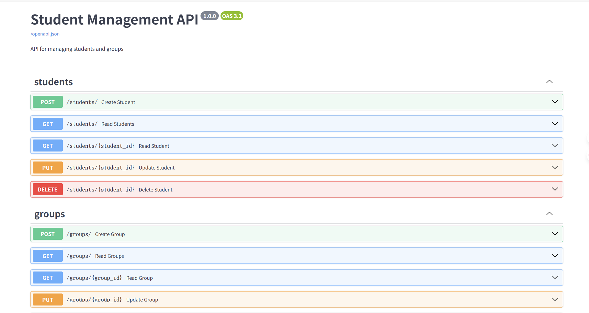

# Experiment 3 : Student Management API
Author: Ши Цзинбо
Class: 30701

## **Project Overview**

This is a **FastAPI-based Student Management System** developed as a **software engineering course assignment**. The application provides a RESTful API for managing students and groups  with full CRUD operations and relationship management.



## **Assignment Requirements**

This project includes the following API endpoints:

- Create Student

- Create Group

- Retrieve Student Information by ID

- Retrieve Group Information by ID

- Delete Student

- Delete Group

- Retrieve Student List

- Retrieve Group List

- Add Student to Group

- Remove Student from Group

- Retrieve All Students in Group

- Move Student from Group A to Group B

##  **Project Structure**

student-api/
├── app/
│   ├── __init__.py
│   ├── main.py              # FastAPI application entry point
│   ├── models.py           # SQLAlchemy database models
│   ├── schemas.py          # Pydantic request/response schemas
│   ├── database.py         # Database connection configuration
│   ├── crud.py             # CRUD operations (Data Access Layer)
│   └── endpoints/          # API endpoints
│       ├── __init__.py
│       ├── students.py     # Student-related endpoints
│       └── groups.py       # Group-related endpoints
├── .env.example           # Environment variables template
├── docker-compose.yml     # Docker Compose configuration
├── Dockerfile            # Docker image configuration
├── requirements.txt      # Python dependencies
├── init.sql             # Database initialization script
└── README.md            # This file

## **Prerequisites**
-   **Docker Desktop** (with Docker Compose)
    
-   **Git** (optional, for version control)
    
-   **Web Browser** (for accessing API documentation)

## **Start with Docker**

**Step 1** **Clone the repository** 
```python
git clone <our url>
cd student-api
```
 **Step 2:  **Start the Application****
 Build and start all services (database + API)
```python
docker-compose up -d --build
```
Check if services are running
```python
docker-compose ps
```
View application logs
```python
docker-compose logs app --tail=20
```
 **Step 3: Access the Application**

-   API Documentation (Swagger UI): [http://localhost:8000/docs](http://localhost:8000/docs)
- Health Check: [http://localhost:8000/health](http://localhost:8000/health)
##  **API Endpoints**

### **Students**

-   `POST /students/` - Create a new student
    
-   `GET /students/` - Get all students
    
-   `GET /students/{student_id}` - Get student by ID
    
-   `PUT /students/{student_id}` - Update student
    
-   `DELETE /students/{student_id}` - Delete student
    

### **Groups**

-   `POST /groups/` - Create a new group
    
-   `GET /groups/` - Get all groups
    
-   `GET /groups/{group_id}` - Get group by ID
    
-   `PUT /groups/{group_id}` - Update group
    
-   `DELETE /groups/{group_id}` - Delete group
    

### **Student-Group Relationships**

-   `POST /groups/add-student` - Add student to group
    
-   `DELETE /groups/remove-student` - Remove student from group
    
-   `GET /groups/{group_id}/students` - Get all students in a group
    
-   `POST /groups/transfer-student` - Transfer student between groups
